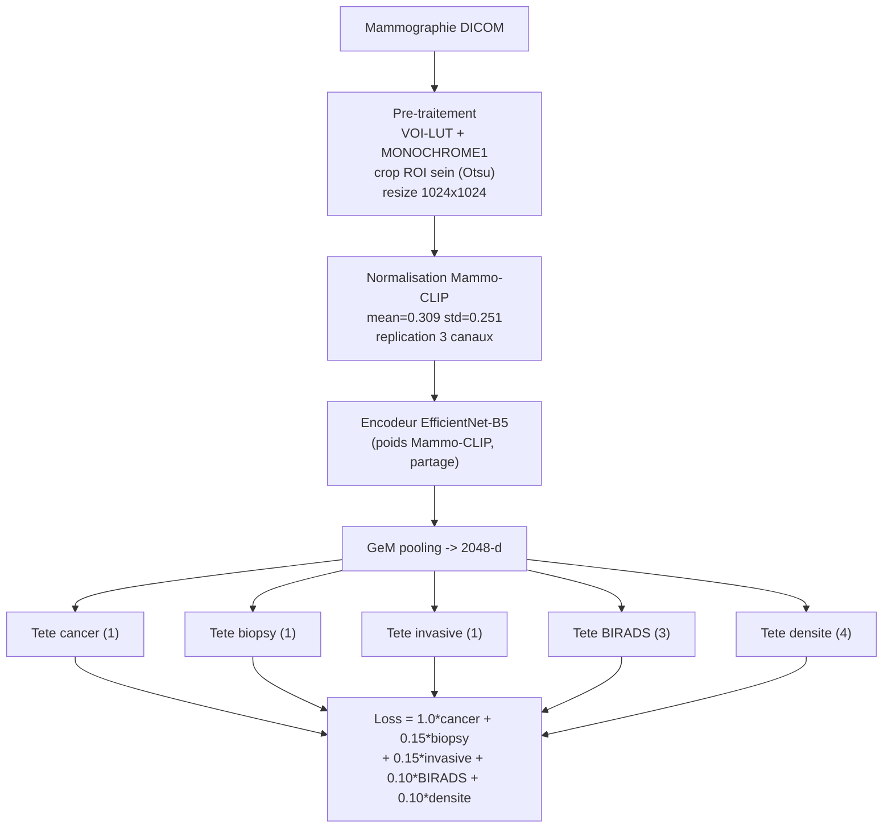

# RSNA Breast Cancer Detection — Mammo-CLIP Multi-Têtes

Détection du cancer du sein sur mammographies de dépistage ([RSNA Screening Mammography Breast Cancer Detection](https://www.kaggle.com/competitions/rsna-breast-cancer-detection)).

Le modèle s'appuie sur un encodeur **EfficientNet-B5 pré-entraîné sur de vraies mammographies** ([Mammo-CLIP](https://github.com/batmanlab/Mammo-CLIP), datasets UPMC + VinDr) — pas d'ImageNet — surmonté de **5 têtes** : une tête principale *cancer* et quatre têtes auxiliaires (*biopsy, invasive, BIRADS, densité*) qui régularisent le tronc partagé.

## Résultats (jeu de test, niveau sein)

| Métrique | Valeur |
|---|---|
| **AUROC (niveau sein)** | **0.861** |
| AUROC (niveau image) | 0.828 |
| F1 (seuil optimal, niveau sein) | 0.30 |

Évaluation au **niveau sein** : les probabilités des images d'un même `(patient, latéralité)` sont moyennées (la prédiction RSNA est par sein). Split **par patient** (70/15/15), aucune fuite entre train/val/test.

<p align="center">
  <br>
  
</p>

## Architecture



**Points clés :**

- **Encodeur mammographie.** `efficientnet-b5` (implémentation `efficientnet_pytorch`) initialisé avec les 852 tenseurs du checkpoint Mammo-CLIP. Entrée 3 canaux (gris répliqué), normalisation spécifique Mammo-CLIP. Voir [`scripts/build_notebook_multihead.py`](scripts/build_notebook_multihead.py).
- **Multi-têtes.** Le tronc est partagé ; chaque tête est un petit MLP (Dropout → Linear → BN → SiLU → Dropout → Linear). Les têtes auxiliaires apportent une supervision clinique qui régularise le tronc — les labels `BIRADS`/`densité` manquants (~50 %) sont **masqués** dans la loss (`ignore_index`).
- **Entraînement en 2 phases.** Phase 1 : tronc **gelé**, on entraîne les têtes (réchauffe sans abîmer le pré-entraînement). Phase 2 : **fine-tuning doux** du tronc (LR 1e-5, 10× plus bas que les têtes). Sélection du meilleur checkpoint sur l'**AUROC sein** de validation.
- **Déséquilibre (~2 % de positifs).** `WeightedRandomSampler` (sur-échantillonnage des positifs) + `pos_weight` sur la tête cancer.
- **Robustesse.** Mixed precision (AMP), gradient accumulation (batch effectif 32), augmentation (flips, rotation, gamma/brightness), **TTA** (flip horizontal) à l'inférence.

## Pré-traitement & cache

Les DICOM sont décodés une seule fois en **JPEG 1024×1024 cropés sur le sein** (q95) → cache réutilisable (`scripts/build_cache_kernel.py`). L'entraînement lit ce cache, jamais les DICOM → tout le budget GPU sert à l'entraînement.

## Structure du dépôt

```
.
├── kaggle/
│   ├── build_cache/        # kernel CPU : DICOM -> cache JPEG 1024 + crop ROI
│   ├── train_multihead/    # kernel GPU : modele multi-tetes (version courante)
│   └── legacy_singlehead/  # version 512 single-head (reference)
├── scripts/                # generateurs de notebooks + utilitaires
│   ├── build_notebook_multihead.py   # genere le notebook multi-tetes
│   ├── build_cache_kernel.py         # genere le kernel de cache
│   └── download_cache.py             # rapatriement pagine des outputs Kaggle
├── src/                    # code pipeline (loader DICOM, crop ROI, windowing)
├── docs/images/            # figures
├── results/                # metriques (JSON) de la version courante
├── requirements.txt
└── Dockerfile
```

> Les notebooks Kaggle sont **générés** par les scripts `scripts/build_*.py` (source unique de vérité, faciles à versionner et à diff).

## Reproduire

### Sur Kaggle (recommandé — GPU T4 gratuit)

1. **Cache** : exécuter `kaggle/build_cache` (CPU) → produit le dataset `rsna-cache-1024-assa` (47 004 images JPEG 1024 cropées).
2. **Entraînement** : ouvrir `kaggle/train_multihead`, vérifier l'accélérateur **GPU T4**, *Run All*. Le checkpoint Mammo-CLIP est téléchargé automatiquement depuis HuggingFace.

### En local / Docker

```bash
# construire l'image
docker build -t rsna-mammoclip .

# régénérer le notebook d'entraînement depuis le script source
docker run --rm -v "$PWD":/work rsna-mammoclip \
    python scripts/build_notebook_multihead.py kaggle/train_multihead/rsna-mammoclip-multihead.ipynb
```

> Le cache d'images (~13 Go) et les poids ne sont **pas** versionnés (voir `.gitignore`) — ils sont hébergés sur Kaggle Datasets / HuggingFace.

## Données & modèle pré-entraîné

- Données : [RSNA Screening Mammography Breast Cancer Detection](https://www.kaggle.com/competitions/rsna-breast-cancer-detection)
- Encodeur : [Mammo-CLIP](https://github.com/batmanlab/Mammo-CLIP) (poids B5 sur [HuggingFace `shawn24/Mammo-CLIP`](https://huggingface.co/shawn24/Mammo-CLIP))

*Projet M2 Bio-informatique — Université Paris Cité.*
