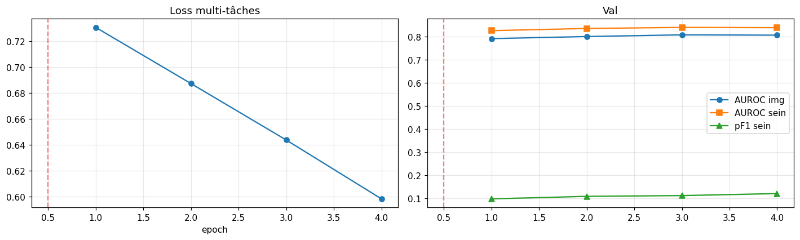
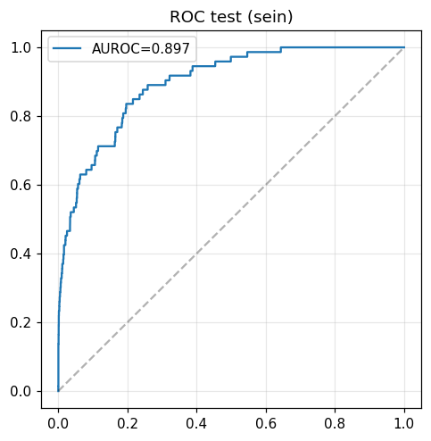
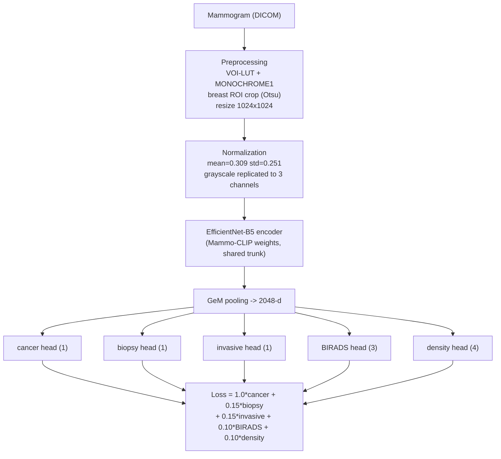

# Breast Cancer Detection on Screening Mammography

A multi-task deep learning model that predicts breast cancer from screening mammograms, built on the
[RSNA Screening Mammography Breast Cancer Detection](https://www.kaggle.com/competitions/rsna-breast-cancer-detection) dataset.

A shared **EfficientNet-B5** image encoder (Mammo-CLIP weights, pretrained on screening mammograms) feeds **five task heads** —
one main *cancer* head and four auxiliary heads (*biopsy, invasive, BIRADS, breast density*) that provide additional clinical
supervision and regularize the shared trunk.

## Results

Evaluated on a held-out test set, at the **breast level** (predictions for images of the same `(patient, laterality)` are
averaged, matching the RSNA target granularity). The split is **patient-wise** (70/15/15) with no leakage across train/val/test.

| Metric | Value |
|---|---|
| **AUROC (breast level)** | **0.897** |
| AUROC (image level) | 0.863 |
| F1 (optimal threshold, breast level) | 0.39 |

<p align="center">
  <br>
  
</p>

## Architecture



**Encoder.** EfficientNet-B5 (`efficientnet_pytorch`) with [Mammo-CLIP](https://github.com/batmanlab/Mammo-CLIP) weights.
Input is a single mammogram replicated to 3 channels and normalized with the encoder's statistics. Features are aggregated
with **Generalized Mean (GeM) pooling** into a 2048-d embedding.

**Multi-task heads.** The trunk is shared across all heads; each head is a small MLP
(`Dropout → Linear → BatchNorm → SiLU → Dropout → Linear`). The main head predicts cancer; the four auxiliary heads predict
clinically related targets. Missing `BIRADS` / `density` labels (~50%) are **masked** in the loss (`ignore_index`), so an
example only contributes to the auxiliary tasks for which it has a label.

**Two-stage training.** Stage 1 freezes the encoder and trains the heads (warm-up). Stage 2 unfreezes the encoder for **gentle
fine-tuning** (encoder LR 1e-5, 10× lower than the heads). The checkpoint with the best **breast-level validation AUROC** is kept.

**Class imbalance (~2% positives).** Handled with a `WeightedRandomSampler` (oversampling positives) and a `pos_weight` on the
cancer head.

**Training & inference robustness.** Automatic mixed precision (AMP), gradient accumulation (effective batch size 32),
data augmentation (flips, small rotations, gamma/brightness jitter), and **test-time augmentation** (horizontal flip).

## Data pipeline

Mammograms are decoded once from DICOM into **breast-cropped 1024×1024 JPEGs** (VOI-LUT windowing, MONOCHROME1 handling,
Otsu-based ROI crop). The model trains from this image cache rather than from DICOM, so the full GPU budget goes to training.

| Resource | Link |
|---|---|
| Competition data (DICOM) | [RSNA Screening Mammography Breast Cancer Detection](https://www.kaggle.com/competitions/rsna-breast-cancer-detection) |
| Preprocessed 1024 JPEG cache | [`testlolll/rsna-cache-1024-assa`](https://www.kaggle.com/datasets/testlolll/rsna-cache-1024-assa) *(private for now — will be made public)* |
| Pretrained encoder weights | [Mammo-CLIP — `shawn24/Mammo-CLIP`](https://huggingface.co/shawn24/Mammo-CLIP) |

## Repository layout

```
.
├── kaggle/
│   ├── build_cache/            # CPU kernel: DICOM -> 1024 JPEG cache (windowing + ROI crop)
│   ├── build_cache_crop/       # CPU kernel: crop-only variant (ablation, no windowing)
│   ├── train_multihead/        # GPU kernel: the multi-task model (current version)
│   └── train_multihead_resume/ # GPU kernel: resume fine-tuning from a checkpoint
├── scripts/                # notebook generators + utilities
│   ├── build_notebook_multihead.py   # generates the multi-task training notebook (--resume supported)
│   ├── build_cache_kernel.py         # generates the cache-building kernel (--nowin for crop-only)
│   └── download_cache.py             # paginated retrieval of Kaggle kernel outputs
├── docs/images/            # figures
├── results/                # metrics (JSON) for the current version
├── requirements.txt
└── Dockerfile
```

The Kaggle notebooks are **generated** from the `scripts/build_*.py` files, which are the single source of truth (easy to
review and diff in version control).

## Reproducing

### On Kaggle (free T4 GPU)

1. **Build the cache** — run `kaggle/build_cache` (CPU); it produces the `rsna-cache-1024-assa` dataset (47,004 cropped 1024 JPEGs).
2. **Train** — open `kaggle/train_multihead`, select the **T4 GPU** accelerator, and *Run All*. The Mammo-CLIP weights are
   downloaded automatically from HuggingFace.

### Locally with Docker

```bash
docker build -t rsna-mammoclip .

# regenerate the training notebook from its source script
docker run --rm -v "$PWD":/work rsna-mammoclip \
    python scripts/build_notebook_multihead.py kaggle/train_multihead/rsna-mammoclip-multihead.ipynb
```

## Reproducibility & FAIR

- **Findable / Accessible.** Data and weights are referenced by stable public identifiers (Kaggle dataset, HuggingFace model);
  the preprocessed cache is published as a versioned Kaggle dataset.
- **Interoperable.** Standard formats throughout (DICOM in, JPEG cache, JSON metrics) and a pinned `requirements.txt`.
- **Reproducible.** Fixed random seed, patient-wise split, deterministic preprocessing, notebooks generated from versioned
  scripts, and a `Dockerfile` that pins the runtime. Heavy artifacts (image cache, model weights) are not committed — they are
  hosted externally and fetched on demand (see `.gitignore`).

## References

- RSNA Screening Mammography Breast Cancer Detection — Kaggle competition.
- Ghosh et al., *Mammo-CLIP: A Vision Language Foundation Model to Enhance Data Efficiency and Robustness in Mammography*, MICCAI 2024.

---

*M2 Bioinformatics project — Université Paris Cité.*
