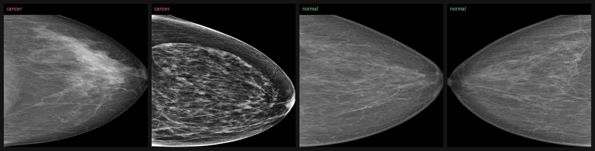
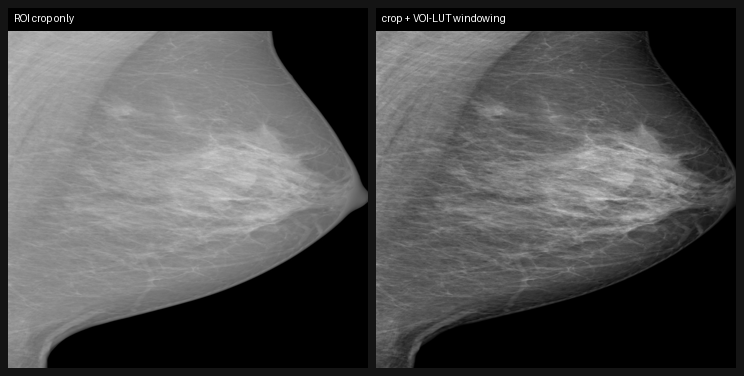
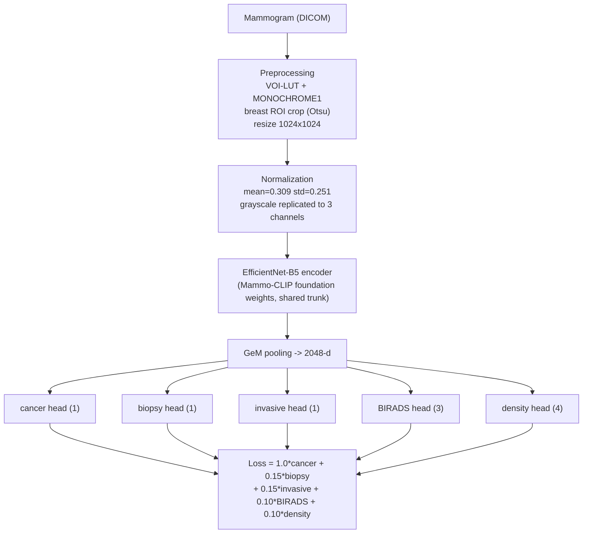

# Adapting a Mammography Foundation Model for Breast Cancer Detection

A study of how to **adapt a domain-specific foundation model** to breast cancer detection on screening
mammography ([RSNA Screening Mammography Breast Cancer Detection](https://www.kaggle.com/competitions/rsna-breast-cancer-detection)).

Rather than training a classifier from scratch, this project starts from **[Mammo-CLIP](https://github.com/batmanlab/Mammo-CLIP)**
— an EfficientNet-B5 image encoder pretrained on screening mammograms — and investigates *what actually matters when
adapting such a model*: multi-task supervision, image preprocessing, the fine-tuning strategy, and probability calibration.
Each design choice is backed by a controlled ablation.

<p align="center">
  
</p>

## Results

Held-out test set, **breast level** (image probabilities of the same `(patient, laterality)` are aggregated, matching the
RSNA target). Patient-wise split (70/15/15), no leakage.

| Metric | Value |
|---|---|
| **AUROC (breast level)** | **0.897** |
| AUROC (image level) | 0.863 |
| F1 (optimal threshold) | 0.42 |
| pF1 (calibrated, RSNA metric) | 0.195 |

<p align="center">
  <br>
  
</p>

## What matters when adapting the foundation model

Three controlled studies, each isolating one design choice (same encoder, same recipe).

**1 — Multi-task supervision.** Adding four auxiliary heads (*biopsy, invasive, BIRADS, density*) on top of the shared
encoder improves breast-level AUROC by **+0.014** over a cancer-only head.

| Variant | AUROC (breast) | AUROC (image) |
|---|---|---|
| Cancer head only | 0.866 | 0.832 |
| Full multi-task (5 heads) | **0.880** | **0.847** |

**2 — Preprocessing (windowing).** Applying DICOM VOI-LUT windowing on top of the breast ROI crop adds **+0.014** AUROC —
the foundation model benefits from the radiologist-intended contrast.

<p align="center">
  
</p>

| Cache preprocessing | AUROC (breast) | AUROC (image) |
|---|---|---|
| ROI crop only | 0.866 | 0.834 |
| ROI crop + VOI-LUT windowing | **0.880** | **0.847** |

**3 — Probability calibration.** The competition metric (probabilistic F1) rewards well-calibrated confident probabilities.
The model ranks cases well but its raw probabilities are diffuse; a single **temperature** fit on validation (no retraining)
nearly doubles the test pF1 while leaving the AUROC unchanged.

| Test pF1 (breast level) | Value |
|---|---|
| Raw probabilities | 0.128 |
| Temperature-scaled (T = 0.4) | **0.195** |

Takeaway: multi-task supervision and windowing each contribute ~+0.014 AUROC, and calibration is essential for the pF1 metric.

## Architecture



- **Encoder.** EfficientNet-B5 (`efficientnet_pytorch`) initialized with the Mammo-CLIP foundation weights. Input is a single
  mammogram replicated to 3 channels with the encoder's normalization; features are pooled with **Generalized Mean (GeM)**.
- **Heads.** The trunk is shared; each head is a small MLP. Missing `BIRADS` / `density` labels (~50%) are **masked** in the loss.
- **Two-stage fine-tuning.** Stage 1 freezes the encoder and warms up the heads; stage 2 unfreezes the encoder for **gentle**
  fine-tuning (encoder LR 1e-5, 10x lower than the heads). The best breast-level validation AUROC checkpoint is kept.
- **Imbalance (~2% positives).** `WeightedRandomSampler` + `pos_weight` on the cancer head.
- **Robustness.** Mixed precision, gradient accumulation (effective batch 32), augmentation, and test-time augmentation.

## Data pipeline

DICOMs are decoded once into **breast-cropped 1024x1024 JPEGs** (VOI-LUT windowing, MONOCHROME1 handling, Otsu ROI crop).
Training reads this cache instead of DICOM, so the full GPU budget goes to learning.

The preprocessing and split choices (removing implants, one image per `(patient, laterality, view)`, handling the
~2% class imbalance and missing density/BIRADS) are motivated in the exploratory analysis — see
[`notebooks/eda.ipynb`](notebooks/eda.ipynb).

| Resource | Link |
|---|---|
| Competition data (DICOM) | [RSNA Screening Mammography Breast Cancer Detection](https://www.kaggle.com/competitions/rsna-breast-cancer-detection) |
| Preprocessed 1024 JPEG cache | [`testlolll/rsna-cache-1024-assa`](https://www.kaggle.com/datasets/testlolll/rsna-cache-1024-assa) *(private for now — will be made public)* |
| Foundation model weights | [Mammo-CLIP — `shawn24/Mammo-CLIP`](https://huggingface.co/shawn24/Mammo-CLIP) |

## Repository layout

```
.
├── kaggle/                         # self-contained Kaggle notebooks (one folder per experiment)
│   ├── build_cache/                # DICOM -> 1024 JPEG cache (windowing + ROI crop)
│   ├── build_cache_crop/           # crop-only cache (preprocessing ablation)
│   ├── train_multihead/            # the multi-task model (main)
│   ├── train_multihead_resume/     # resume fine-tuning from a checkpoint
│   ├── train_multihead_crop/       # training on the crop-only cache (ablation)
│   ├── ablation_cancer_only/       # cancer head only (multi-task ablation)
│   └── calibration/                # pF1 temperature-scaling calibration
├── scripts/                        # notebook generators + utilities (single source of truth)
│   ├── make_splits.py              # deterministic train/val/test split from the competition CSV
│   ├── build_notebook_multihead.py # training notebook (--resume / --cancer-only)
│   ├── build_cache_kernel.py       # cache kernel (--nowin for crop-only)
│   ├── build_calibration.py        # pF1 calibration notebook
│   └── download_cache.py           # paginated retrieval of Kaggle kernel outputs
├── notebooks/eda.ipynb             # exploratory data analysis (motivates the design choices)
├── docs/images/                    # figures
├── results/                        # metrics (JSON)
├── pixi.toml                       # environment & tasks
└── Dockerfile
```

Kaggle notebooks are **generated** from the `scripts/build_*.py` files — the single source of truth, easy to review and diff.

## Reproducing

**Environment** ([pixi](https://pixi.sh)):

```bash
pixi install
pixi run build-train      # regenerate the training notebook from its source script
```

**Full pipeline from public sources** (no private dataset required):

1. **Split** — download the competition data, then `python scripts/make_splits.py train.csv` regenerates the exact
   patient-wise split (`df_final.csv` + `X/Y_{train,val,test}.csv`), deterministically (seed 42).
2. **Cache** — run `kaggle/build_cache` (CPU) to build the 1024 JPEG cache (47,004 images) from the DICOMs.
3. **Train** — open `kaggle/train_multihead`, select the **T4** accelerator, *Run All*. The Mammo-CLIP foundation
   weights are downloaded automatically from HuggingFace.
4. **Calibrate** — run `kaggle/calibration` to temperature-scale the probabilities for the pF1 metric.

## Reproducibility & FAIR

- **Findable / Accessible** — data and weights referenced by stable public identifiers (Kaggle dataset, HuggingFace model).
- **Interoperable** — standard formats throughout (DICOM in, JPEG cache, JSON metrics); environment pinned via `pixi.toml`.
- **Reproducible** — fixed seed, patient-wise split, deterministic preprocessing, notebooks generated from versioned scripts,
  and a `Dockerfile` pinning the runtime. Heavy artifacts (image cache, weights) are hosted externally, not committed.

## References

- RSNA Screening Mammography Breast Cancer Detection — Kaggle competition.
- Ghosh et al., *Mammo-CLIP: A Vision Language Foundation Model to Enhance Data Efficiency and Robustness in Mammography*, MICCAI 2024.

---

*M2 Bioinformatics project — Université Paris Cité.*
